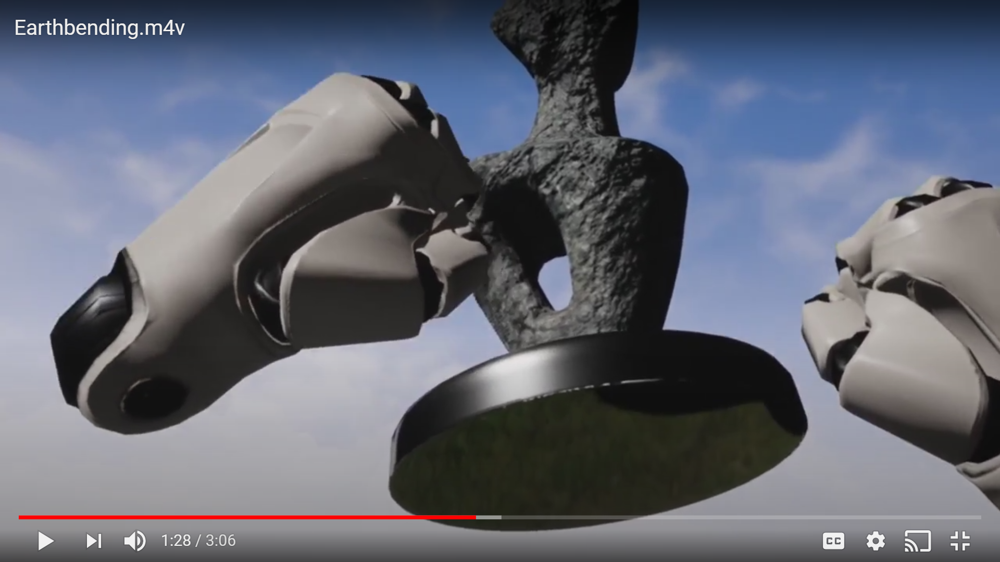

# Earthbending

Earthbend in VR!

## Controls
Point your oculus hands towards higlightable objects. When the object is highlighted, you may take control of the object by
holding down on the triggers. Once the trigger is held down, the object will follow your hands' movement. Objects can be
grabbed with both hands, in which case they will move easier.

Objects can be exploded into fragments at any time by grabbing with both hands and quickly moving the two hands away from each other.
Objects can also be thrown, caught, and transferred between hands.

## Technology
Made with Unreal Engine, and developed for Oculus VR.

